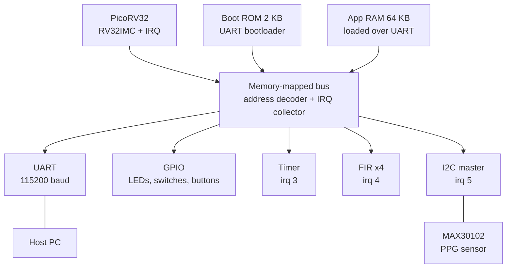

# VitalSoC

**A configurable RISC-V SoC for hardware-accelerated multi-modal physiological signal processing.**

VitalSoC is a small System-on-Chip built around the open-source [PicoRV32](https://github.com/YosysHQ/picorv32) RISC-V core and implemented on a Xilinx 7-series FPGA (Digilent Boolean Spartan-7 or ZedBoard). Its main addition is a memory-mapped, four-channel FIR filter accelerator that cleans ECG and PPG signals in real time, so the processor stays free for sensing, communication and decision logic. A resident UART bootloader lets you load new firmware without rebuilding the bitstream, so the SoC behaves like a reprogrammable microcontroller.

> **Not a medical device.** VitalSoC is a signal-processing and system-integration platform. It does not diagnose anything, and any SpO2 value would be an uncalibrated estimate.

---

## Why this project

ECG and PPG signals are noisy: baseline wander, 50/60 Hz mains pickup, muscle and motion artefacts. Heart-rate and pulse-oximetry algorithms need them filtered on a fixed schedule, every sample. Software filtering on a small processor costs cycles and ties timing to the rest of the firmware, while fixed-function chips cannot be adapted to a new sensor or filter. VitalSoC shows a middle path: a programmable processor plus a small, reconfigurable hardware filter on one low-cost FPGA.

## Features

- **PicoRV32 (RV32IMC)** with hardware multiply and divide and interrupts, on its native memory interface (no AXI).
- **4-channel FIR accelerator.** One shared multiply-accumulate unit, a separate 64-tap coefficient bank and delay line per channel, Q1.15 coefficients, 40-bit accumulator, saturating 16-bit output, done interrupt. About 67 clock cycles per sample.
- **Run-time configurable.** Coefficients are loaded over the bus, so a channel can be an ECG band-pass, a PPG low-pass, or any other FIR filter without re-synthesis.
- **UART bootloader.** A 2 KB boot ROM receives the application over UART into RAM and jumps to it.
- **Peripherals:** UART, timer with interrupt, GPIO (LEDs, switches, buttons), and an I2C master for a MAX30102 PPG sensor.
- **Bit-exact verification.** Self-checking testbenches compare the RTL against a Python fixed-point model.

## Architecture



### Memory map (target)

| Base address | Size | Block | Notes |
|---|---|---|---|
| `0x0000_0000` | 2 KB | Boot ROM | Reset vector, read-only |
| `0x1000_0000` | 64 KB | App RAM | Application is uploaded here |
| `0x2000_0000` | 4 KB | UART | Data and status registers |
| `0x3000_0000` | 4 KB | GPIO | LEDs, switches, buttons |
| `0x4000_0000` | 4 KB | Timer | 1 kHz tick by default |
| `0x5000_0000` | 4 KB | FIR accelerator | 4 channels |
| `0x6000_0000` | 4 KB | I2C master | MAX30102 at address `0x57` |

Unmapped addresses return `0xDEADBEEF` instead of hanging the core. 

### Interrupts

| Line | Source |
|---|---|
| `irq[3]` | Timer tick |
| `irq[4]` | FIR done |
| `irq[5]` | I2C transfer complete |

`irq[0..2]` are used internally by PicoRV32.

## The FIR accelerator

The CPU only sees a few registers at `0x5000_0000`:

| Offset | Register | Purpose |
|---|---|---|
| `0x00` | `CTRL` | Start, interrupt enable, channel select |
| `0x04` | `STATUS` | Busy, done (write 1 to clear) |
| `0x08` | `DATA_IN` | Signed 16-bit sample |
| `0x0C` | `DATA_OUT` | Filtered sample |
| `0x10` | `COEF_ADDR` | `{channel, tap}` |
| `0x14` | `COEF_DATA` | Coefficient; the write triggers the store |

Filtering one sample from C:

```c
FIR_DATA_IN = sample;            // 1. write the input
FIR_CTRL    = (ch << 8) | 1;     // 2. channel + start
while (!(FIR_STATUS & 2)) ;      // 3. wait for done (or use irq[4])
y = (int16_t)FIR_DATA_OUT;       // 4. read the result
FIR_STATUS = 2;                  // 5. clear done
```

Computation, per channel: `y[n] = saturate16( (sum of coef[k] * x[n-k], k = 0..63) >> 15 )`.

Default channel plan (generated by `model/fir_golden.py`):

| Channel | Signal | Filter | Rate |
|---|---|---|---|
| 0 | ECG (QRS detection) | Band-pass 5 to 25 Hz | 250 Hz |
| 1 | PPG red | Low-pass 4 Hz | 100 Hz |
| 2 | PPG IR | Low-pass 4 Hz | 100 Hz |
| 3 | ECG (spare, self-test) | Low-pass 40 Hz | 250 Hz |


## Repository layout

```
rtl/            Verilog: fir_core, fir_periph, vitalsoc_top, soc_timer, soc_gpio, bram32
tb/             Testbenches and test vectors (.mem)
model/          Python golden model, coefficient and vector generators
fw/             Firmware: startup, linker script, drivers, DSP code, host test
constraints/    Board constraint files (verify every pin before use)
docs/           Register reference and design notes
```

## Results


| Metric | Value |
|---|---|
| LUT / FF / DSP / BRAM | 2826 / 1837 / 1 / 18 |
| Worst negative slack at 100 MHz | 0.251ns |
| FIR accelerator, cycles per sample | 316 cycles |
| Software FIR, cycles per sample | 69080 cycles |
| Speed-up | 218.6x |

## Intended applications

Home and remote heart-rate monitoring, wearable pulse sensing, worker-safety alerts, a pre-processing front end for edge-AI arrhythmia classifiers, a teaching platform for RISC-V SoC design, and a prototype for low-power health-monitoring chips. These are intended uses, only the filtering, heart-rate reporting and reprogrammable workflow are demonstrated by this project.

## Limitations

- ECG is replayed from a stored test vector. Live ECG acquisition is not part of the current scope.
- The software FIR uses a 32-bit accumulator, which is fine for ECG-sized inputs but can overflow on full-scale signals. The hardware uses 40 bits.
- A CPU reset does not clear FIR coefficients or delay lines. The firmware must reload coefficients and flush every channel on start-up.
- The UART bootloader loads RAM only. A power cycle or reset requires a new upload.
- Heart-rate detection is a simple adaptive-threshold detector, not clinically validated.

## Team

- Navneet Prasad, 3rd year ECE
- Bejin B, 3rd year ECE
- Ramkumar P, 3rd year ECE

## Acknowledgements

- [PicoRV32](https://github.com/YosysHQ/picorv32) by Claire Xenia Wolf, ISC licence.
- OpenCores I2C IP.

